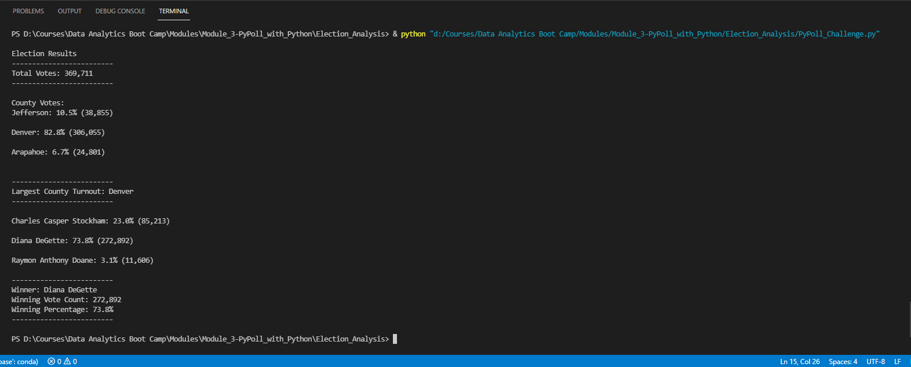

# Election_Analysis

## Overview of Election Audit
A Colorado Board of Elections employee has given you the following tasks to complete the election audit of a recent local congressional election.

- Calculation the total number of votes cast.
- Get the voter turnout for each county.
- Calculate the total number of votes, and percentage of votes from each county out of the total count.
- Determine the county with the highest turnout.
- Get a complete list of candidates who received votes.
- Calculate the total number of votes each candidate received.
- Calculate the percentage of votes each candidate won.
- Determine the winner of the election based on popular vote.

## Election Audit Results


[Election Results in TXT file](analysis/election_results.txt)

- How many votes were cast in this congressional election?
    - There were **_369,711_** votes cast in the election.

- Provide a breakdown of the number of votes and the percentage of total votes for each county in the precinct.
    - County **_Jefferson_** received **_38,855_** number of votes and **_10.5%_** out of the total votes.
    - County **_Denver_** received **_306,055_** number of votes and **_82.8%_** out of the total votes.
    - County **_Arapahoe_** received **_24,801_** number of votes and **_6.7%_** out of the total votes.

- Which county had the largest number of votes?
    - **_Denver_** had the largest number of votes.

- Provide a breakdown of the number of votes and the percentage of the total votes each candidate received.
    - Candidate **_Charles Casper Stockham_** received **_23.0%_** of the votes and **_85,213_** number of votes.
    - Candidate **_Diana DeGette_** received **_73.8%_** of the votes and **_272,892_** number of votes.
    - Candidate **_Raymon Anthony Doane_** received **_3.1%_** of the votes and **_11,606_** number of votes.

- Which candidate won the election, what was their vote count, and what was their percentage of the total votes?
    - Candidate **_Diana DeGette_**, who received **_73.81%_** of the votes and **_272,892_** number of votes.


## Election Audit Summary
The script [PyPoll_Challenge.py](PyPoll_Challenge.py) we developed in this analysis can be modified so that it can be used in other elections.
1. Provide a breakdown of the number of votes and the percentage of the total votes each candidate received **for each county**
    - Create a list of dictionaries `county_candidate_data = []` where the keys are "county", "candidate" and "counts", and each county and each candidate, and the corresponding vote counts are the values for those keys.
    - In each row read from the CSV data file, if the current county and candidate is NOT in the dictionary `county_candidate_data`, append a new record to the dictionary.
    ```
    county_candidate_data.append({"county":"Arapahoe", "candidate":"Charles Casper Stockham", "counts":0})
    ```
    - Add a vote to that county-candidate's vote count.
    ```
    county_candidate_data[i]["counts"] += 1
    ```
    -  Write a for-loop to get the county from the dictionary `county_candidate_data`:
        -  Retrieve the candidate name and the vote count for that candidate in that county.
        -  Calculate the votes as a percentage of the total votes of that county.
        -  Print the county-candidate results to the terminal and output file.

2. Generalize the script to analyse election results for different states
    - Assuming the source file [election_results.csv](Resources/election_results.csv) also included the "State" info
    - Create a list of dictionaries `state_county_candidate_data = []` where the keys are "state", "county", "candidate" and "counts", and each state and each county and each candidate, and the corresponding vote counts are the values for those keys.
    - In each row read from the CSV data file, if the current state and county and candidate is NOT in the dictionary `state_county_candidate_data`, append a new record to the dictionary.
    ```
    state_county_candidate_data.append({"state":"Colorado", "county":"Arapahoe", "candidate":"Charles Casper Stockham", "counts":0})
    ```
    - Add a vote to that state-county-candidate's vote count.
    ```
    state_county_candidate_data[i]["counts"] += 1
    ```
    -  Use for-loop to get the state list from the dictionary `state_county_candidate_data`:
        -  For each state:
            -  Use for-loop to get the county list of this state.
            -  For each county:
                -  Retrieve the candidate name and the vote count for that candidate in that county.
                -  Calculate the votes as a percentage of the total votes of that county.
                -  Print the county-candidate results to the terminal and output file.
                -  Print the winning candidate information for this county.
            -  Retrieve the vote counts in that state.
            -  Calculate the votes as a percentage of the total votes of all the states.
            -  Print the results to the terminal and output file.
